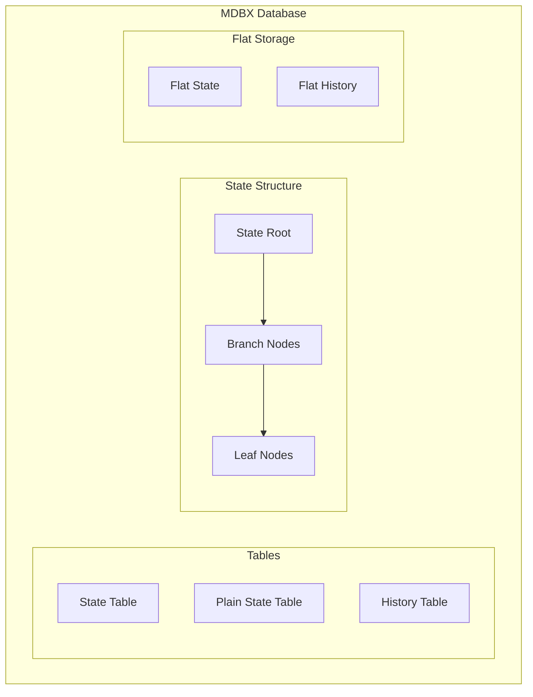
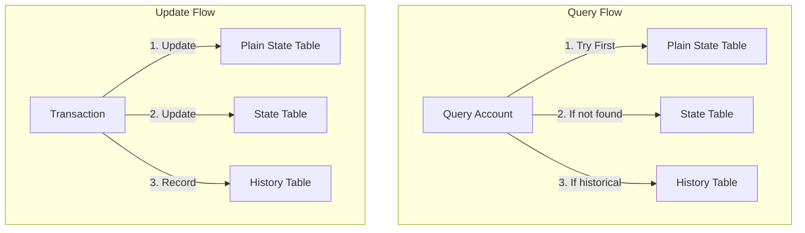
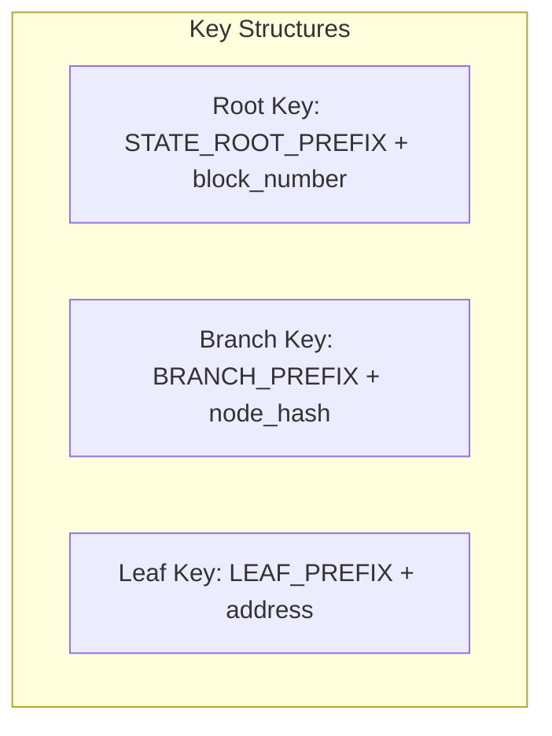
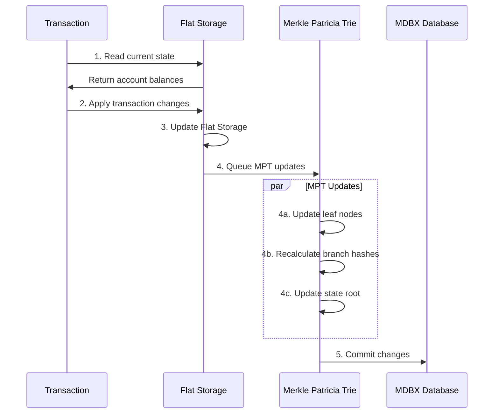
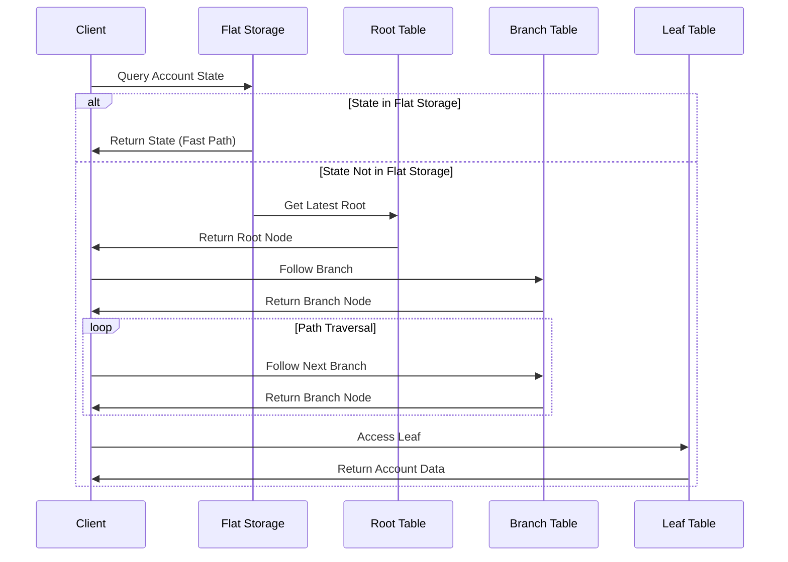
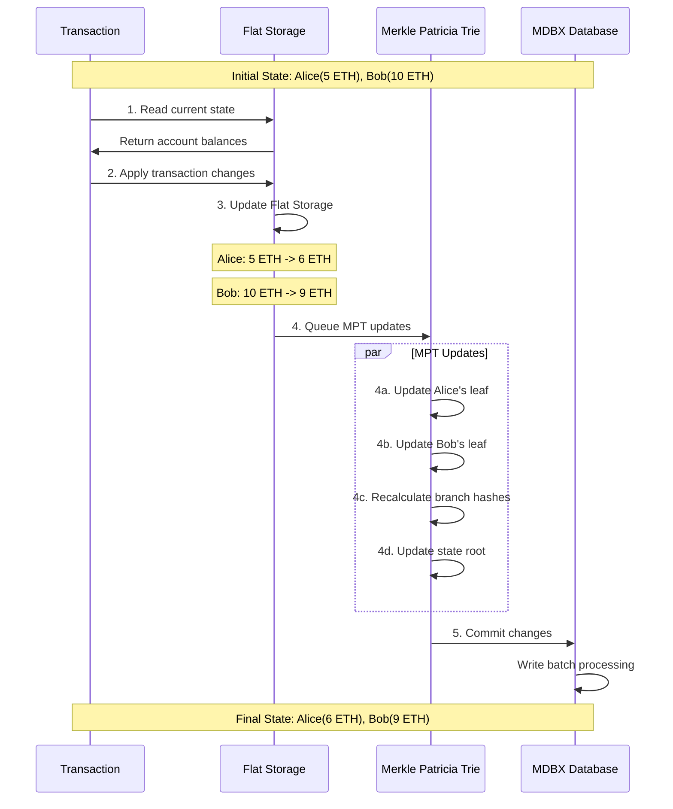

# Reth State Storage System Documentation

## Table of Contents
- [Reth State Storage System Documentation](#reth-state-storage-system-documentation)
  - [Table of Contents](#table-of-contents)
  - [Overview](#overview)
    - [Key Components](#key-components)
  - [State Storage Architecture](#state-storage-architecture)
    - [Node Types and Storage Layout](#node-types-and-storage-layout)
    - [Database Structure](#database-structure)
  - [Data Flow and Operations](#data-flow-and-operations)
    - [State Updates](#state-updates)
- [MPT Storage in MDBX](#mpt-storage-in-mdbx)
  - [Overview](#overview-1)
  - [Key Concepts](#key-concepts)
  - [Example: Storing an MPT in MDBX](#example-storing-an-mpt-in-mdbx)
    - [MPT Key-Value Pairs](#mpt-key-value-pairs)
      - [Trie Representation](#trie-representation)
      - [MDBX Storage Structure](#mdbx-storage-structure)
    - [Visual Representation in MDBX](#visual-representation-in-mdbx)
  - [How It Works](#how-it-works)
    - [Read Operations](#read-operations)
  - [Example Implementation](#example-implementation)
    - [Workflow](#workflow)
    - [State Update Process](#state-update-process)
  - [Advanced Topics](#advanced-topics)
    - [Optimization Techniques](#optimization-techniques)
    - [Data Integrity](#data-integrity)

## Overview

Reth (Rust Ethereum) implements a sophisticated state storage system using MDBX as its database backend. The system combines flat storage for recent state access with a Modified Merkle Patricia Trie (MPT) for historical state management.

### Key Components





| Feature                | State Table                                         | Plain State Table                    | History Table                             |
| ---------------------- | --------------------------------------------------- | ------------------------------------ | ----------------------------------------- |
| **Purpose**            | Stores current state MPT nodes (root, branch, leaf) | Stores current account data directly | Stores historical state changes           |
| **Key Format**         | `state_prefix + node_hash`                          | `plain_state_prefix + address`       | `history_prefix + block_number + address` |
| **Value Format**       | RLP encoded node data                               | RLP encoded account data             | RLP encoded historical account data       |
| **Access Pattern**     | Traversal through MPT                               | Direct key-value lookup              | Block number + address lookup             |
| **Update Frequency**   | Every state change                                  | Every state change                   | Only on state changes                     |
| **Storage Efficiency** | Higher storage overhead (MPT structure)             | Most efficient (flat storage)        | Highest storage (keeps history)           |
| **Query Speed**        | O(log n) - requires MPT traversal                   | O(1) - direct lookup                 | O(1) - direct lookup with block number    |
| **Primary Use Case**   | Historical state verification                       | Fast current state access            | Historical state queries                  |
| **Data Structure**     | Merkle Patricia Trie nodes                          | Flat key-value pairs                 | Timestamped key-value pairs               |
| **Node Types**         | Root, Branch, Extension, Leaf                       | N/A (flat structure)                 | N/A (flat structure)                      |
| **Pruning Support**    | Yes (with constraints)                              | No (always current)                  | Yes (configurable retention)              |
| **Consistency Model**  | Strong (MPT verified)                               | Eventually consistent                | Strong (immutable history)                |
| **Recovery Support**   | Full recovery possible                              | Requires State Table                 | Full recovery possible                    |
| **Memory Usage**       | Higher (caches nodes)                               | Lower (direct access)                | Medium (block-indexed)                    |
| **Write Pattern**      | Batch updates                                       | Single puts                          | Append-only                               |
| **Verification**       | Merkle proofs supported                             | No cryptographic proofs              | Block-linked verification                 |
| **Performance Cost**   | Higher CPU usage                                    | Lowest CPU usage                     | Medium CPU usage                          |

## State Storage Architecture

### Node Types and Storage Layout

1. **Root Node**
   - Stores block-specific state roots
   - Contains references to branch nodes
   - Includes metadata like block number and timestamp

2. **Branch Node**
   - Intermediate nodes in the MPT
   - Contains up to 16 child references
   - Supports path compression via extension nodes

3. **Leaf Node**
   - Contains actual account state
   - Stores balance, nonce, storage root, and code hash

### Database Structure



<details>
<summary>Node Storage Formats</summary>

```javascript
// Root Node
{
    key: "r:" + blockNumber.toString(16),
    value: {
        rootHash: "0xabcd...",
        timestamp: 1673432400,
        branchRefs: ["0x1234...", "0x5678..."],
        metadata: {
            blockNumber: 14000000,
            stateVersion: 1
        }
    }
}

// Branch Node
{
    key: "b:" + nodeHash,
    value: {
        nodeType: 2, // 1=extension, 2=branch
        children: [
            "0x1234...",  // Child 0
            "0x5678...",  // Child 1
            null,         // No child
            "0x9abc...",  // Child 3
            // ... up to 16 children
        ],
        nodeHash: "0xdef...",
        extensionPath: null
    }
}

// Leaf Node
{
    key: "l:" + address,
    value: {
        account: {
            nonce: 42,
            balance: "5000000000000000000",
            storageRoot: "0x0000...",
            codeHash: "0x0000..."
        },
        proof: {
            path: "0x1234...",
            witnesses: ["0xabcd...", "0xefgh..."]
        }
    }
}
```
</details>

## Data Flow and Operations

### State Updates



<details>
<summary>
MDBX
</summary>

# MPT Storage in MDBX

## Overview
This document explains how a Modified Patricia Trie (MPT) is stored in an MDBX database using key-value pairs. Each node in the MPT corresponds to a key-value entry in MDBX, optimized for storage and retrieval.

---

## Key Concepts

1. **Keys**:
   - Represent the path to a node in the trie.
   - Encoded as sequences of nibbles (hex digits).

2. **Values**:
   - Store the node's data, including references to child nodes, account balances, or storage roots.
   
---

## Example: Storing an MPT in MDBX

### MPT Key-Value Pairs
- `0x1234` → Account A (nonce, balance, etc.)
- `0x1256` → Account B
- `0x78` → Account C

#### Trie Representation
```
Root
 |
 +-- Branch(0x1)
      |
      +-- Extension(0x23)
      |     |
      |     +-- Leaf(0x1234 → Account A)
      |
      +-- Branch(0x25)
            |
            +-- Leaf(0x1256 → Account B)
 +-- Leaf(0x78 → Account C)
```

#### MDBX Storage Structure
MDBX stores this structure as key-value pairs:

| Key      | Value                            |
| -------- | -------------------------------- |
| `0x1`    | Reference to branch (0x23, 0x25) |
| `0x1234` | Account A data                   |
| `0x1256` | Account B data                   |
| `0x78`   | Account C data                   |

### Visual Representation in MDBX
```
MDBX
+------------------+
| Key   | Value    |
+-------+----------+
| 0x1   | 0x23,0x25|
| 0x23  | 0x1234   |
| 0x1234| Account A|
| 0x25  | 0x1256   |
| 0x1256| Account B|
| 0x78  | Account C|
+-------+----------+
```

---

## How It Works
1. A **key** in MDBX corresponds to the **path** in the MPT.
2. A **value** stores the node data or references to child nodes.
3. For **branch nodes**, the value is a list of child references.
4. For **leaf nodes**, the value contains the account or storage data.

This storage model optimizes the MPT structure by breaking it into smaller, efficient database entries while maintaining the integrity of the trie for updates and lookups.


</details>

### Read Operations



<details>
<summary>Node Access Implementation</summary>

```rust
pub fn get_account(&self, address: Address) -> Result<Account> {
    // Try flat storage first
    if let Some(account) = self.flat_storage.get(&address)? {
        return Ok(account);
    }

    // Fall back to MPT
    let path = address.to_nibbles();
    let mut current = self.get_root()?;
    
    for nibble in path {
        match current {
            Node::Branch(branch) => {
                let child_hash = branch.children[nibble as usize]
                    .ok_or(Error::InvalidPath)?;
                current = self.get_node(child_hash)?;
            }
            Node::Leaf(_) => break,
            Node::Extension(ext) => {
                if ext.path.starts_with(&[nibble]) {
                    current = self.get_node(ext.child)?;
                } else {
                    return Err(Error::InvalidPath);
                }
            }
        }
    }
    
    match current {
        Node::Leaf(leaf) => Ok(leaf.account),
        _ => Err(Error::InvalidPath),
    }
}
```
</details>

## Example Implementation

Let's look at a concrete example of state transitions:

Initial State:
```
Alice: 5 ETH
Bob: 10 ETH
```

After Transaction:
```
Alice: 6 ETH
Bob: 9 ETH
```

### Workflow

<details>
<summary>Workflow</summary>



</details>

### State Update Process

<details>
<summary>Implementation Details</summary>

```javascript
// 1. Read Current State
let aliceState = flatStorage.get("0x123...");  // Alice's address
let bobState = flatStorage.get("0x456...");    // Bob's address

// 2. Apply Changes
aliceState.balance += 1n * BigInt(1e18);  // Add 1 ETH
bobState.balance -= 1n * BigInt(1e18);    // Subtract 1 ETH

// 3. Update Flat Storage
flatStorage.put(aliceState.address, aliceState);
flatStorage.put(bobState.address, bobState);

// 4. Queue MPT Updates
let batch = new WriteBatch();
batch.put(`l:${aliceState.address}`, encode(aliceState));
batch.put(`l:${bobState.address}`, encode(bobState));

// 5. Update Branch Nodes
updateBranchNodes(batch, aliceState.address);
updateBranchNodes(batch, bobState.address);

// 6. Commit Changes
db.write(batch);
```
</details>

## Advanced Topics

### Optimization Techniques

1. **Flat Storage**
   - Direct key-value lookups for recent state
   - O(1) access time
   - Background reconciliation with MPT

2. **Caching**
   - Multi-level cache hierarchy
   - Prefetching for likely accessed states
   - Write-back caching for batching

3. **Parallelization**
   - Concurrent MPT updates
   - Parallel transaction processing
   - Asynchronous disk writes

### Data Integrity

1. **Hash Verification**
   - All nodes contain cryptographic hashes
   - Automatic verification during traversal
   - Merkle proofs for state verification

2. **Reference Counting**
   - Tracks node usage
   - Enables garbage collection
   - Prevents orphaned nodes

