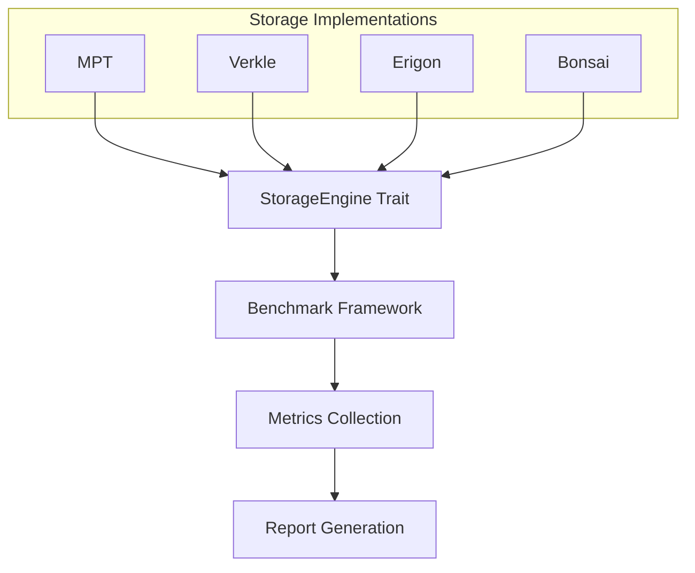
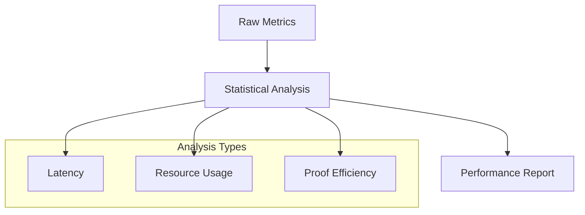
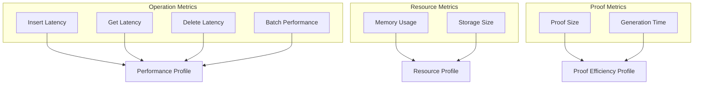

# Storage Benchmarking Framework

A modular framework for benchmarking different blockchain storage implementations.

## Architecture



## Core Components

### StorageEngine Trait
```rust
pub trait StorageEngine {
    fn insert(&mut self, key: Vec<u8>, value: Vec<u8>) -> Result<(), Error>;
    fn get(&self, key: &[u8]) -> Result<Option<Vec<u8>>, Error>;
    fn delete(&mut self, key: &[u8]) -> Result<(), Error>;
    fn batch_insert(&mut self, kvs: &[(Vec<u8>, Vec<u8>)]) -> Result<(), Error>;
    fn prove(&self, key: &[u8]) -> Result<Vec<u8>, Error>;
}
```

Defines standard interface for storage implementations:
- CRUD operations
- Batch processing
- Proof generation

### Metrics Collection


Collected Metrics:
- Latency (insert/get/delete)
- Proof metrics (size/generation time)
- Resource usage (memory/storage)
- Batch performance

### Performance Analysis



## Usage Example

```rust
// Implement StorageEngine
impl StorageEngine for MyTrie {
    // Implementation...
}

// Create and run benchmark
let trie = MyTrie::new();
let mut framework = BenchmarkFramework::new(trie);
framework.benchmark_single_operations(10000);
```

## Key Metrics & Analysis



## Implementation Notes

1. **Memory Measurement**
   - System-specific implementation required
   - Sampling at regular intervals
   - Peak usage tracking

2. **Storage Size**
   - Engine-specific implementation needed
   - Accounts for:
     - Data structure overhead
     - Serialization format
     - Proof metadata

3. **Error Handling**
   - Comprehensive error types
   - Operation recovery
   - Metric consistency

## Future Extensions

1. **Additional Metrics**
   - Network I/O
   - CPU profiling
   - Cache hit rates

2. **Analysis Features**
   - Percentile calculations
   - Trend analysis
   - Comparative visualization

## Trade-off Analysis

| Metric            | Impact              | Optimization Strategy |
| ----------------- | ------------------- | --------------------- |
| Proof Size        | Verification cost   | Commitment schemes    |
| Memory Usage      | Client requirements | Pruning strategies    |
| Batch Performance | Throughput          | I/O optimization      |

## Benchmark Configuration

```rust
pub struct BenchmarkConfig {
    num_operations: usize,
    batch_sizes: Vec<usize>,
    key_size: usize,
    value_size: usize
}
```

Key parameters affecting benchmark results:
- Operation count
- Batch sizes
- Data sizes
- Sampling intervals