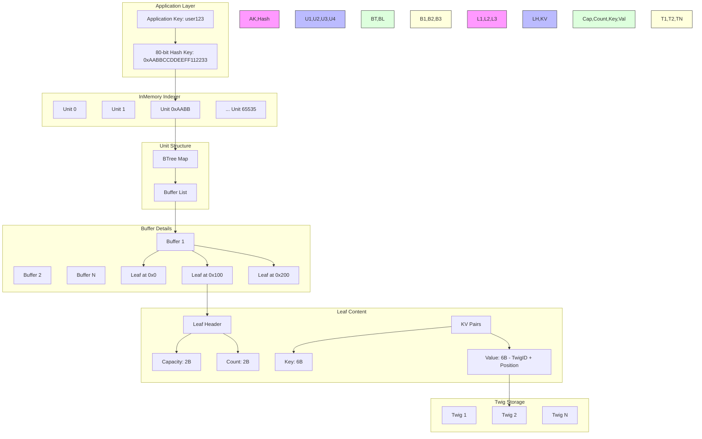
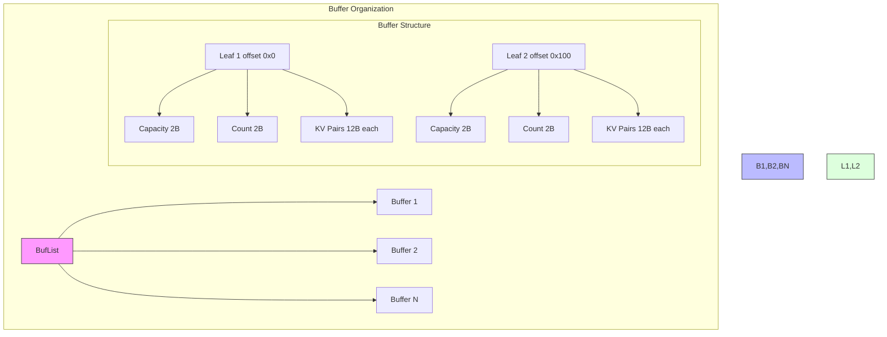
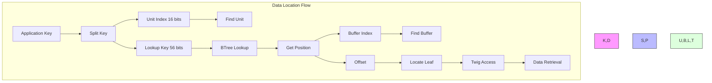

# QMDB: Understanding Data Location and Retrieval

This document explains how QMDB efficiently locates and retrieves data using its innovative indexing system.

## Architecture Overview



<details>
<summary>
80-bit hash calculation
</summary>

The 80-bit hash key in QMDB is created from two main components:

```rust
// Example input key: "user123" with balance data

// 1. Application Key Processing
key = "user123"
balance_data = "1000"

// 2. Hash Generation (80 bits total)
|---- 16 bits ----|--------------- 56 bits ------------|--- 8 bits ---|
[   Unit Index    ][        Lookup Value              ][  Extra Data  ]
      0xAABB          0xCCDDEEFF1122                      0x33

// Actual Implementation (from QMDB code)
fn get_inputs(&self, k80: &[u8], v: i64) -> (usize, u64, i64) {
    let idx = BigEndian::read_u16(&k80[..2]) as usize;     // Unit Index
    let k56 = (BigEndian::read_u64(&k80[1..9]) << 8) >> 8; // Lookup Value
    (idx % self.units.len(), k56, v / 8)
}
```

Key aspects:
- Unit index (16 bits): Determines which of 65536 Units handles this key
- Lookup value (56 bits): Used for BTree lookups within Unit
- Extra data (8 bits): Additional metadata or version information
- Full hash: 0xAABBCCDDEEFF112233

</details>

## Key Components

### 1. InMemory Indexer
- Maintains 65,536 Units (2¹⁶)
- Each Unit handles a subset of keys based on high 16 bits
- Provides concurrent access through RwLocks

### 2. Units
```rust
pub struct Unit {
    bt: BTreeMap<u64, u64>,     // Maps keys to positions
    buf_list: BufList,          // Buffer storage
    last_size: u32,             
    change_count: u32
}
```



### 3. Buffer List Structure
```rust
struct BufList {
    list: Vec<Box<[u8]>>,  // List of 10KB buffers
    offset: usize          // Current write position
}

// Each buffer contains multiple Leaves:
[
    // Leaf Header
    2 bytes: capacity    // Max KV pairs
    2 bytes: count       // Current KV pairs
    // KV Pairs
    6 bytes: key        // Truncated key
    6 bytes: value      // twig_id + position
]
```

## Data Location Process

### 1. Key Processing
```rust
// Input: "user123"
80-bit key = hash("user123")  // e.g., 0xAABBCCDDEEFF112233

// Split key:
unit_index = 0xAABB              // High 16 bits
lookup_key = 0xCCDDEEFF112233    // Next 56 bits
```

### 2. Position Encoding
```rust
Position (64-bit): 0x0001000000000200
|    |     |
|    |     └── Offset (0x200)
|    └── Unused
└── Buffer index (1)
```



## Retrieval Process

1. **Key to Unit**:
   - Hash application key
   - Use high 16 bits to find Unit

2. **BTree Lookup**:
   - Use 56-bit lookup key
   - Get position encoding buffer location

3. **Buffer Access**:
   - Extract buffer index and offset
   - Direct access to Leaf data

4. **Data Access**:
   - Read twig_id and position from Leaf
   - Direct access to data in Twig

## Optimization Over Traditional MPT

### Traditional MPT (Ethereum)
- O(log n) operations
- Multiple node traversals
- Path-dependent lookups

### QMDB
- O(1) direct access after BTree lookup
- No tree traversal in Twigs
- Position-based direct jumping

## Performance Benefits

1. **Reduced I/O**:
   - Single SSD read per state access
   - Batched writes (2048 entries)

2. **Memory Efficiency**:
   - Small memory footprint
   - Efficient buffer management

3. **Concurrency**:
   - Independent Units
   - Lock-free reads

This design enables QMDB to achieve significant performance improvements over traditional MPT structures while maintaining data integrity and verification capabilities.