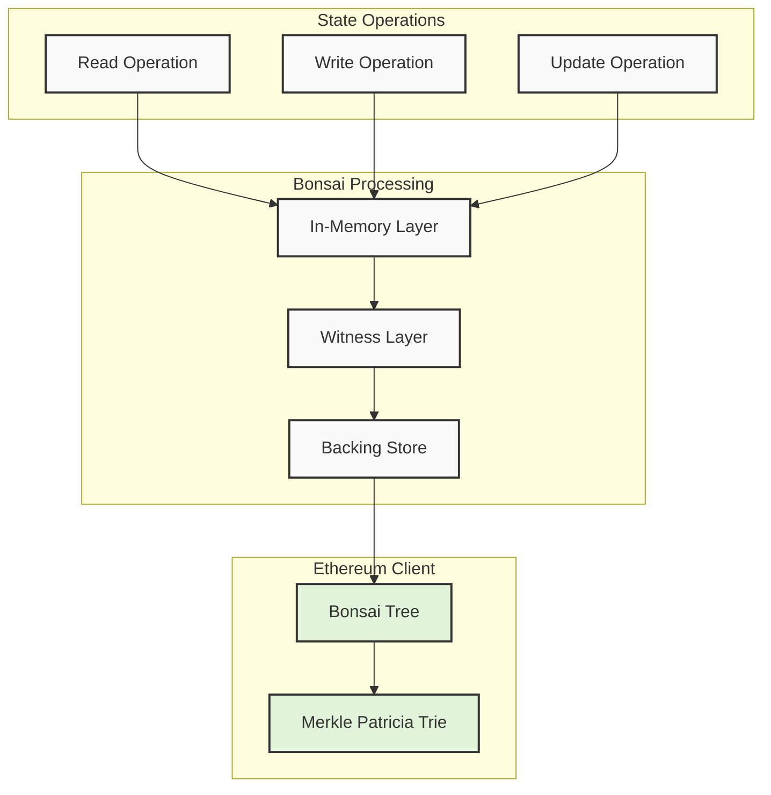
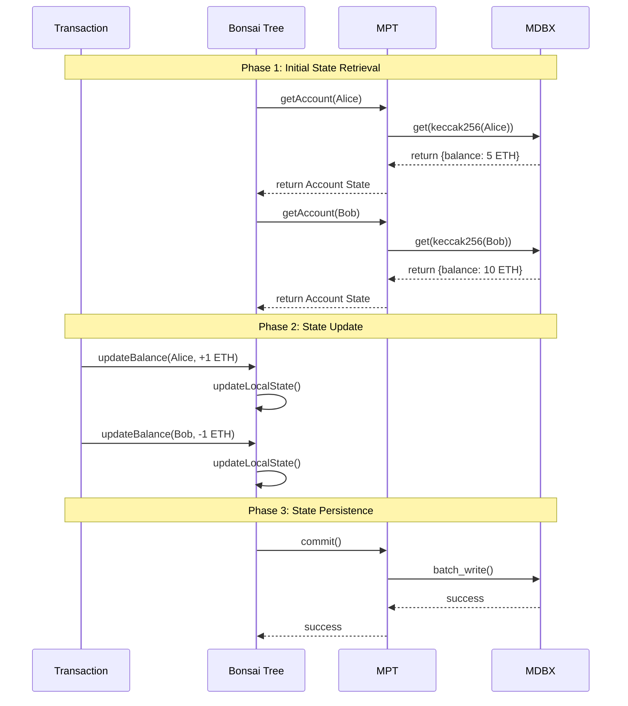

# Understanding Bonsai Tree to MPT State Transitions in Ethereum

This document explains how ConsenSys Bonsai Tree manages state transitions and interacts with the Merkle Patricia Trie (MPT) in Ethereum clients, with a focus on practical examples and implementation details.

## Table of Contents
- [Overview](#overview)
- [State Transition Example](#state-transition-example)
- [Implementation Details](#implementation-details)
- [Complexity Analysis](#complexity-analysis)

## Overview

The process involves three main components:
1. Bonsai Tree (in-memory state)
2. Merkle Patricia Trie (MPT)
3. MDBX Storage

### Basic Flow Diagram



## State Transition Example

Let's walk through a practical example of a balance transfer between two accounts:

Initial State:
- Alice: 5 ETH
- Bob: 10 ETH

Final State:
- Alice: 6 ETH
- Bob: 9 ETH

### Transaction Flow



## Implementation Details

### 1. State Retrieval Implementation

<details>
<summary>Click to see the code</summary>

```typescript
class BonsaiTree {
    async getAccountState(address: Address): Promise<Account> {
        // Check cache (not found in this case)
        if (!this.cache.has(address)) {
            // Get account path
            const path = keccak256(address);  // O(1)
            
            // Retrieve from MPT
            const account = await this.mpt.get(path);  // O(log n)
            
            // Cache the result
            this.cache.set(address, account);  // O(1)
        }
        return account;
    }
}

class MerklePatriciaTrie {
    async get(path: Buffer): Promise<Account> {
        // Start from root node
        let node = await this.getNode(this.rootHash);  // O(1)
        
        // Traverse path to leaf
        for (const nibble of path) {  // O(log n)
            node = await this.getNode(node.children[nibble]);
        }
        
        return node.value;
    }
}
```
</details>

### 2. State Update Implementation

<details>
<summary>Click to see the code</summary>

```typescript
class BonsaiTree {
    async updateBalance(address: Address, amount: BigInt) {
        // Get current account state
        const account = await this.getAccountState(address);  // O(log n)
        
        // Update balance in memory
        account.balance += amount;  // O(1)
        
        // Add to dirty set
        this.dirtyAccounts.add(address);  // O(1)
        
        // Update cache
        this.cache.set(address, account);  // O(1)
    }
}
```
</details>

### 3. State Persistence Implementation

<details>
<summary>Click to see the code</summary>

```typescript
class BonsaiTree {
    async commit(): Promise<void> {
        // Process all dirty accounts
        for (const address of this.dirtyAccounts) {  // O(k) where k is number of changed accounts
            const account = this.cache.get(address);
            
            // Update MPT
            await this.mpt.put(keccak256(address), account);  // O(log n)
        }
        
        // Get new root hash
        const newRoot = await this.mpt.getRootHash();  // O(1)
        
        // Commit to MDBX
        await this.mdbx.commit(this.batch);  // O(k)
        
        // Clear dirty set
        this.dirtyAccounts.clear();  // O(1)
    }
}

class MerklePatriciaTrie {
    async put(path: Buffer, value: Account): Promise<void> {
        // Update or create leaf node
        let node = this.createLeafNode(value);  // O(1)
        
        // Update path to root
        for (const nibble of path.reverse()) {  // O(log n)
            node = this.updateBranchNode(nibble, node);
        }
        
        // Update root hash
        this.rootHash = node.hash;  // O(1)
    }
}
```
</details>

## Complexity Analysis

### Operation Complexities

1. Read Operation (getAccountState):
   - Time Complexity: O(log n)
     * Path calculation: O(1)
     * MPT traversal: O(log n)
     * MDBX lookup: O(1)
   - Space Complexity: O(1)

2. Update Operation (updateBalance):
   - Time Complexity: O(log n)
     * State retrieval: O(log n)
     * Memory update: O(1)
   - Space Complexity: O(1)

3. Commit Operation:
   - Time Complexity: O(k log n)
     * k = number of modified accounts
     * n = total number of accounts
     * For each account: O(log n) MPT update
   - Space Complexity: O(k)

### Overall Transaction Complexity
```
Time Complexity: O(k log n)
Space Complexity: O(k)

Where:
- k = number of accounts modified
- n = total number of accounts in the state
```

### Performance Considerations
1. The most expensive operation is the MPT traversal (O(log n))
2. Batch updates help amortize the cost of MDBX writes
3. Caching helps reduce repeated MPT traversals
4. RLP encoding/decoding adds constant overhead to each operation